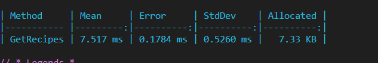

# ??? RecipeShare

A simple RESTful API and Angular app for creating and managing cooking recipes.

## ? Features

- ? ASP.NET Core 6 Web API with EF Core
- ? Full CRUD for recipes
- ? Filtering by dietary tags
- ? Client-side Angular UI
- ? Server-side and client-side validation
- ? Unit tests with xUnit & Moq

## ?? Benchmark Results

**500 GET calls to `/api/recipes` in Release mode**